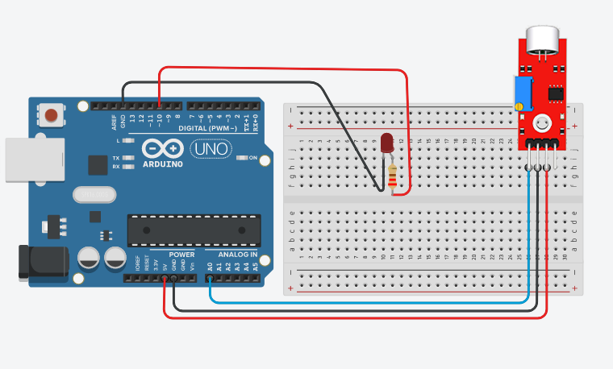

# Clap Switch with Arduino Uno R3

This project demonstrates how to interface a Sound Sensor with an Arduino Uno R3 to create a simple Clap Switch system. The LED toggles ON and OFF whenever a clap or sound is detected by the sensor.

Hardware Components

Arduino Uno R3

Sound Sensor Module

LED

Jumper wires

Breadboard

How It Works

The sound sensor continuously monitors surrounding sound levels.

When a clap or sharp sound is detected, the sensor output changes state.

Arduino detects the sound event and toggles the LED state.

If the LED is OFF, it turns ON.

If the LED is ON, it turns OFF.

Pin Connections

| Component | Arduino Pin |
|---|---|
| Sound Sensor OUT | 2 |
| LED (+) | 13 |
| Sensor VCC | 5V |
| Sensor GND | GND |

Circuit Diagram

YouTube Demonstration

🔗 Watch the project in action on YouTube https://YOUR_YOUTUBE_LINK
